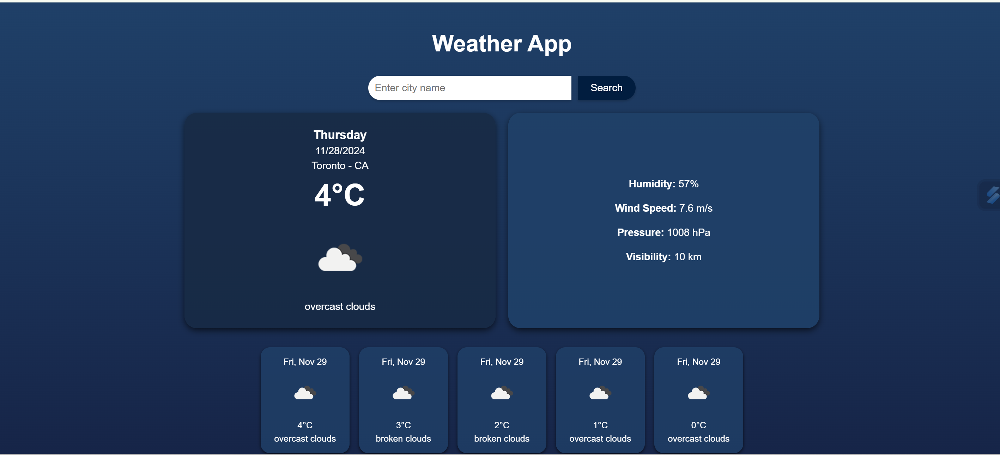

# Weather App 🌤️

A beautiful and responsive Weather App that provides current weather details and a 5-day forecast for any city. Built with ReactJS, the OpenWeatherMap API, and modern CSS styling, this app allows users to search for real-time weather data with a user-friendly interface.

---

## Features

- **Default City**: Displays weather for Toronto by default on load.
- **Search Functionality**: Search for weather details in any city worldwide.
- **Current Weather Details**:
  - Temperature
  - Weather condition (e.g., cloudy, sunny, rain)
  - Humidity
  - Wind speed
  - Pressure
  - Visibility
- **5-Day Weather Forecast**:
  - Temperature for each day
  - Weather condition (with icons)
  - Humidity and wind speed
- **Responsive Design**: Optimized for desktop and mobile layouts with a modern UI/UX.

---

## Screenshots

### **Home Screen**

### **5-Day Forecast**

### **Search Functionality**
